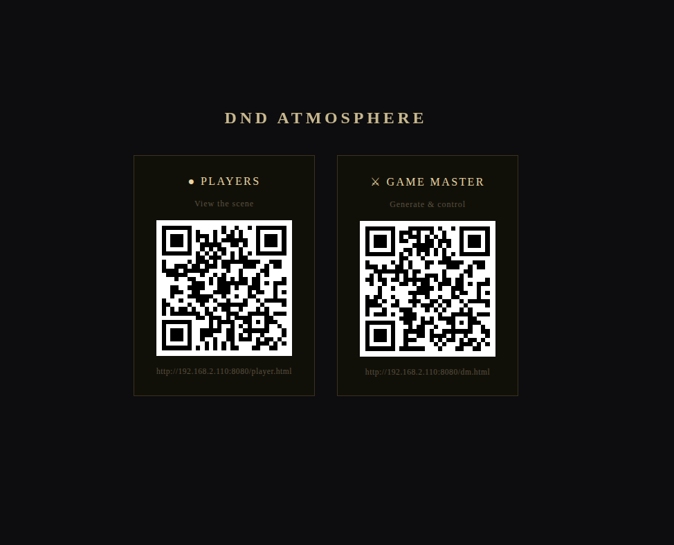
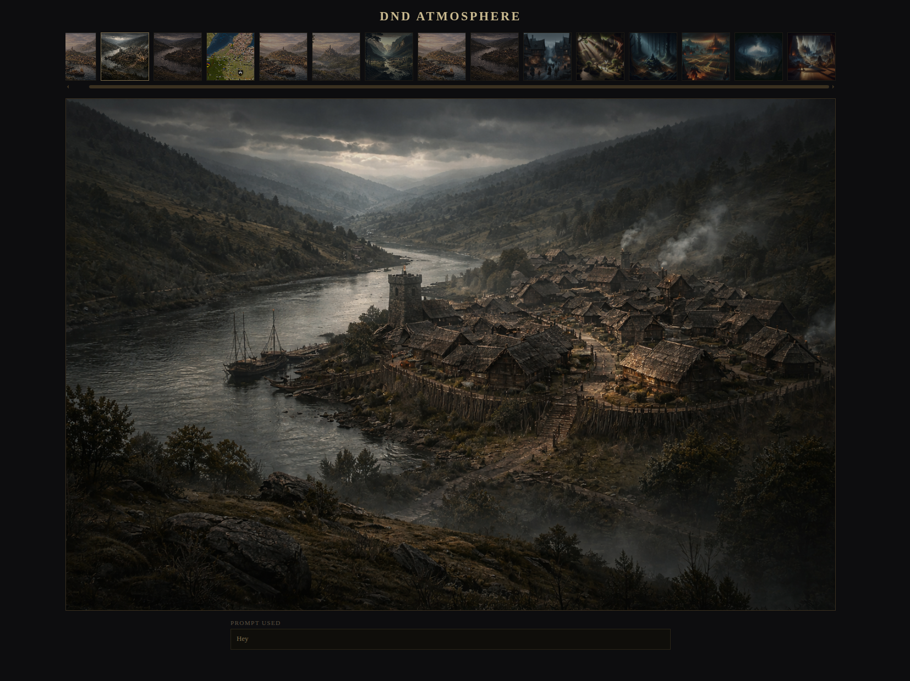
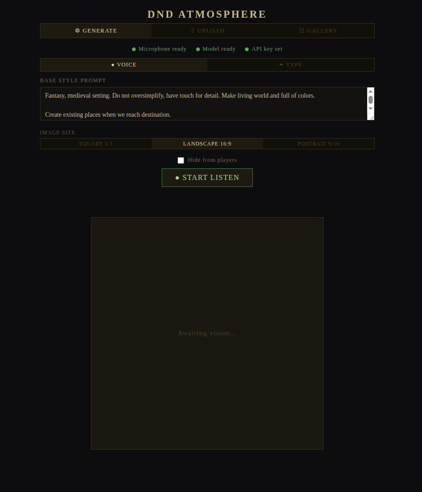

# DnD Atmosphere Generator

Describe a scene by voice or text → it gets transcribed and turned into an atmospheric image.
Built for DnD sessions: the DM generates images, players see them live on their own devices.

## Requirements

- Docker + Docker Compose
- OpenAI API key
- ~500 MB–3 GB disk space for the Whisper model (see below)

## Setup

**1. Configure your API key**

```bash
cp .env.example .env
# Edit .env and paste your OpenAI API key
```

**2. Download a Whisper model**

Whisper converts your spoken description into text. Pick a model based on your hardware:

| Model | Size | Quality | Transcription time (CPU) |
|-------|------|---------|--------------------------|
| `tiny` | 75 MB | poor | ~5s |
| `base` | 142 MB | mediocre | ~10s |
| `small` | 466 MB | decent | ~30s |
| `medium` | 1.4 GB | **good** ← recommended | ~90s |
| `large` | 2.9 GB | best | ~4 min |

```bash
./dnd-atmo model medium
```

**3. Start**

```bash
./dnd-atmo run
```

First start takes several minutes (compiles whisper.cpp from source). Subsequent starts are instant.

## Pages

| URL | Who uses it |
|-----|-------------|
| `http://localhost:8080` | Homepage — QR codes and links to both interfaces |
| `http://localhost:8080/dm.html` | DM interface |
| `http://<host-ip>:8080/player.html` | Player viewer (any device on the LAN) |

The homepage auto-detects your LAN IP and shows ready-to-scan QR codes for both the DM and player pages.

## DM Interface

Three tabs: **Generate**, **Upload**, **Gallery**.

### Generate tab

Two input modes:

- **Voice** — click **Start Listen**, describe the scene out loud, then **Do The Magic** to submit (or **I Changed My Mind** to discard). The transcription is shown so you can verify what was heard.
- **Type** — type a scene description directly and click **Do The Magic**.

Both modes use the **Base Style Prompt** to define the consistent visual style for your session (e.g. art style, mood, colour palette). The scene description is appended to it when generating.

Use **Image Size** to switch between square, landscape, and portrait before generating.

Check **Hide from players** before submitting to generate an image privately — it will not appear on the player page until you reveal it.

### Upload tab

Upload one or more images from disk to add them to the gallery without generating. Supports drag-and-drop. Accepts an optional description. The **Hide from players** checkbox works here too.

### Gallery tab

Shows all session images as a scrollable carousel. Click a thumbnail to preview it in the large frame below. Hover a thumbnail to reveal:

- **◎ / ●** — toggle visibility for players (filled dot = hidden)
- **×** — delete the image permanently

Delete and hide/show controls are only available from `localhost` — players cannot modify the gallery.

## Player Viewer

A minimal read-only page. Shows the current image full-width with a scrollable carousel above.
Updates automatically every 5 seconds — no refresh needed.
Clicking any carousel thumbnail switches the main image. Clicking the main image opens it full-size.

## Commands

```bash
./dnd-atmo run           # check setup and start
./dnd-atmo stop          # stop containers
./dnd-atmo restart       # rebuild and restart (picks up code changes)
./dnd-atmo logs          # tail container logs
./dnd-atmo model medium  # download/replace Whisper model (tiny/base/small/medium/large)
```

## Cost

Images use DALL-E 3 (~$0.04 per image). Cost per image, session total, and lifetime total are shown in the footer of the DM interface and persisted in `data/costs.json`.

## Data

```
public/sessions/YYYY-MM-DD/image_NN.png      — generated/uploaded images
public/sessions/YYYY-MM-DD/image_NN.txt      — prompt used for each image
public/sessions/YYYY-MM-DD/image_NN.hidden   — sidecar: marks image as hidden from players
data/costs.json                              — lifetime and session cost tracking
models/ggml-model.bin                        — whisper model (not bundled in Docker image)
```

## Examples



